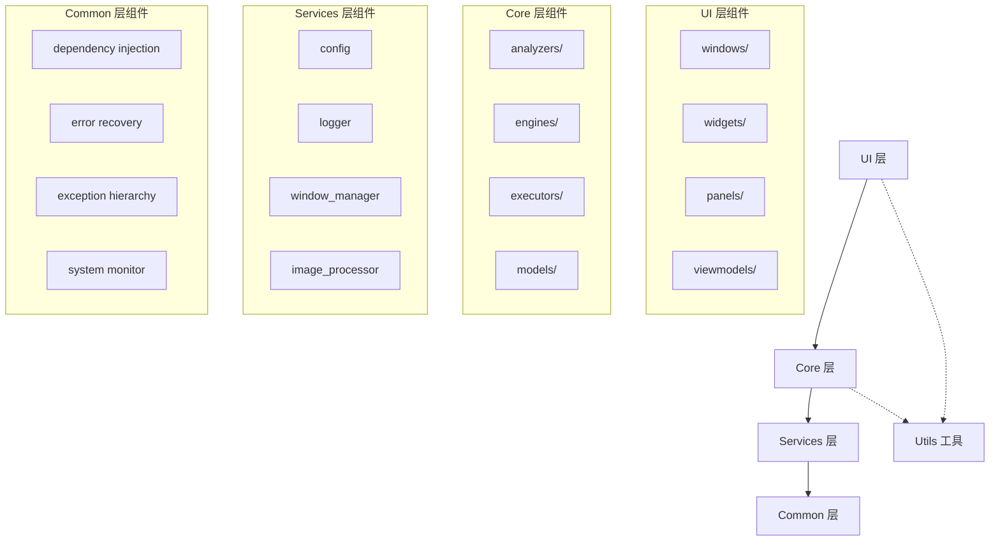
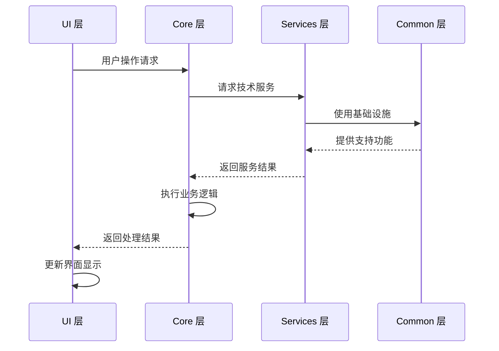
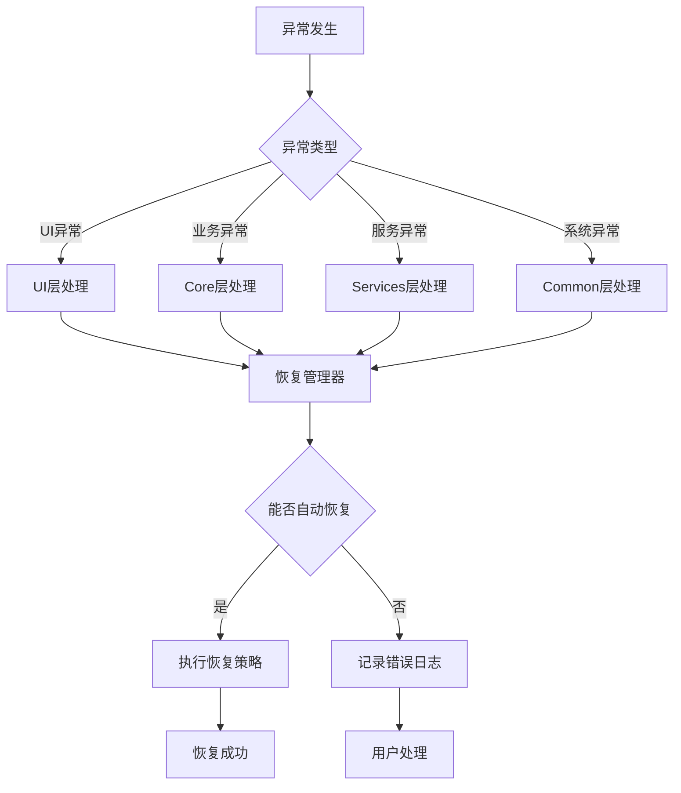

# 🏗️ 架构设计文档

## 📖 概述

本文档详细描述了游戏自动化工具的架构设计，解释了从传统MVVM架构到现代化四层分层架构的演进过程，以及新架构的设计理念、实现细节和使用指导。

## 🎯 设计理念和原则

### 核心理念

**分离关注点 (Separation of Concerns)**
> 每个层次只负责特定的职责，避免功能混杂

**单向依赖 (Unidirectional Dependencies)**
> 建立清晰的依赖方向，避免循环依赖

**高内聚低耦合 (High Cohesion, Low Coupling)**
> 层内功能高度相关，层间依赖最小化

**开放封闭原则 (Open-Closed Principle)**
> 对扩展开放，对修改封闭

### 设计原则

1. **职责单一原则**: 每个组件只有一个变化的理由
2. **依赖倒置原则**: 高层模块不依赖低层模块，都依赖抽象
3. **接口隔离原则**: 不依赖不需要的接口
4. **最小知识原则**: 组件只与直接合作的组件交互

## 🏗️ 分层架构详解

### 架构概览

```
┌─────────────────────────────────────────┐
│                UI 层                    │  🖥️ 用户界面层
│  ┌─────────────────────────────────────┐│
│  │    展示逻辑 │ 用户交互 │ 视图管理   ││  
│  │  界面组件 │ 事件处理 │ 数据绑定   ││  
│  └─────────────────────────────────────┘│
└─────────────────┬───────────────────────┘
                  │ 调用业务接口
┌─────────────────┴───────────────────────┐
│               Core 层                   │  🎯 核心业务逻辑层
│  ┌─────────────────────────────────────┐│
│  │  游戏分析 │ 决策引擎 │ 任务编排   ││  
│  │  状态管理 │ 业务规则 │ 数据模型   ││  
│  └─────────────────────────────────────┘│
└─────────────────┬───────────────────────┘
                  │ 使用技术服务
┌─────────────────┴───────────────────────┐
│             Services 层                 │  🔧 基础服务层
│  ┌─────────────────────────────────────┐│
│  │  配置管理 │ 日志服务 │ 窗口管理   ││  
│  │  图像处理 │ 输入模拟 │ 资源管理   ││  
│  └─────────────────────────────────────┘│
└─────────────────┬───────────────────────┘
                  │ 依赖基础设施
┌─────────────────┴───────────────────────┐
│             Common 层                   │  🔗 通用基础设施层
│  ┌─────────────────────────────────────┐│
│  │  依赖注入 │ 异常处理 │ 错误恢复   ││  
│  │  系统初始化│ 监控工具 │ 通用工具   ││  
│  └─────────────────────────────────────┘│
└─────────────────────────────────────────┘
```

### 依赖关系图



## 📋 职责分配说明

### UI 层 (User Interface Layer)

**职责**: 用户交互界面和展示逻辑

**包含组件**:
```
src/ui/
├── windows/         # 主窗口和对话框
├── widgets/         # 可复用的UI控件
├── panels/          # 功能面板组件
├── components/      # 通用UI组件
├── managers/        # UI状态管理器
├── viewmodels/      # 视图模型（MVVM模式）
├── styles/          # 界面样式和主题
└── editors/         # 配置和代码编辑器
```

**核心职责**:
- ✅ 用户界面展示和布局
- ✅ 用户输入事件处理
- ✅ 数据绑定和视图更新
- ✅ 界面状态管理
- ✅ 用户交互体验优化

**不负责**:
- ❌ 业务逻辑处理
- ❌ 数据持久化
- ❌ 游戏分析算法
- ❌ 系统级操作

### Core 层 (Business Logic Layer)

**职责**: 核心业务逻辑和领域模型

**包含组件**:
```
src/core/
├── unified_game_analyzer.py  # 统一游戏分析器
├── task_system.py           # 任务编排系统
├── state_machine.py         # 状态机管理
├── game_adapter.py          # 游戏适配器
├── analyzers/              # 分析器组件
│   ├── image_recognition.py    # 图像识别分析
│   └── pattern_matcher.py      # 模式匹配分析
├── engines/               # 决策引擎
│   ├── decision_engine.py      # 决策引擎
│   └── dqn_agent.py           # DQN强化学习代理
├── executors/             # 执行器组件
│   ├── action_executor.py      # 动作执行器
│   └── input_controller.py     # 输入控制器
├── collectors/            # 数据收集器
│   └── screen_collector.py     # 屏幕数据收集
├── models/               # 业务数据模型
│   ├── game_state.py          # 游戏状态模型
│   └── state_history_model.py  # 状态历史模型
└── automation/           # 自动化逻辑
    └── auto_operator.py        # 自动化操作器
```

**核心职责**:
- ✅ 游戏状态分析和识别
- ✅ 决策逻辑和策略制定
- ✅ 任务编排和流程控制
- ✅ 业务规则和约束管理
- ✅ 领域模型和数据结构

**不负责**:
- ❌ 用户界面展示
- ❌ 底层技术服务
- ❌ 系统级配置管理
- ❌ 基础设施功能

### Services 层 (Technical Services Layer)

**职责**: 技术服务和基础功能

**包含组件**:
```
src/services/
├── config.py              # 配置管理服务
├── logger.py              # 日志记录服务
├── window_manager.py      # 窗口管理服务
├── image_processor.py     # 图像处理服务
├── action_simulator.py    # 动作模拟服务
├── template_collector.py  # 模板收集服务
├── capture_engines.py     # 多引擎捕获系统
├── resource_manager.py    # 资源管理服务
├── exceptions.py          # 服务专用异常
└── game_analyzer.py       # 游戏分析适配器
```

**核心职责**:
- ✅ 配置数据管理和访问
- ✅ 日志记录和调试支持
- ✅ 窗口捕获和操作
- ✅ 图像处理和分析基础
- ✅ 输入模拟和硬件交互
- ✅ 外部资源管理

**不负责**:
- ❌ 业务决策逻辑
- ❌ 用户界面组件
- ❌ 系统初始化流程
- ❌ 依赖注入管理

### Common 层 (Infrastructure Layer)

**职责**: 通用基础设施和跨层次支持

**包含组件**:
```
src/common/
├── containers.py          # 依赖注入容器
├── recovery.py            # 错误恢复机制
├── system_initializer.py  # 系统初始化器
├── exceptions.py          # 通用异常基类
├── error_handler.py       # 错误处理器
├── monitor.py             # 系统监控工具
├── app_utils.py           # 应用级工具函数
└── system_cleanup.py      # 系统清理工具
```

**核心职责**:
- ✅ 依赖注入和对象生命周期管理
- ✅ 异常处理和错误恢复
- ✅ 系统初始化和配置
- ✅ 跨层次的通用工具
- ✅ 应用级监控和诊断

**不负责**:
- ❌ 具体业务逻辑
- ❌ 用户界面功能
- ❌ 技术服务实现
- ❌ 领域相关概念

## 🔄 数据流和控制流

### 典型交互流程



### 错误处理流程



## 🔌 扩展点和插件机制

### 依赖注入扩展

```python
# 注册新服务
from src.common.containers import DIContainer

container = DIContainer()

# 注册新的分析器
container.register('CustomAnalyzer', CustomAnalyzer, singleton=True)

# 注册服务工厂
container.register_factory('DynamicService', create_dynamic_service)

# 获取服务实例
analyzer = container.get('CustomAnalyzer')
```

### 游戏分析器扩展

```python
# 扩展统一游戏分析器
from src.core.unified_game_analyzer import UnifiedGameAnalyzer

class CustomGameAnalyzer(UnifiedGameAnalyzer):
    def __init__(self, *args, **kwargs):
        super().__init__(*args, **kwargs)
        self.custom_detectors = []
    
    def add_custom_detector(self, detector):
        """添加自定义检测器"""
        self.custom_detectors.append(detector)
    
    def analyze_frame(self, frame):
        """扩展分析逻辑"""
        # 调用基础分析
        result = super().analyze_frame(frame)
        
        # 添加自定义检测
        for detector in self.custom_detectors:
            custom_result = detector.detect(frame)
            result.update(custom_result)
        
        return result
```

### UI组件扩展

```python
# 扩展UI组件
from src.ui.widgets.base_widget import BaseWidget

class CustomWidget(BaseWidget):
    def __init__(self, parent=None):
        super().__init__(parent)
        self.setup_ui()
    
    def setup_ui(self):
        """设置自定义UI"""
        # 自定义界面逻辑
        pass
    
    def on_data_changed(self, data):
        """处理数据变化"""
        # 自定义数据处理
        pass
```

### 服务扩展

```python
# 扩展服务层
from src.services.base_service import BaseService

class CustomService(BaseService):
    def __init__(self, config, logger):
        super().__init__(config, logger)
        self.initialize()
    
    def initialize(self):
        """初始化自定义服务"""
        pass
    
    def process_request(self, request):
        """处理自定义请求"""
        return self.custom_logic(request)
```

## 🚀 性能考虑

### 架构性能优化

1. **分层缓存策略**:
   ```python
   # UI层缓存
   - 界面状态缓存
   - 渲染结果缓存
   
   # Core层缓存
   - 分析结果缓存
   - 决策结果缓存
   
   # Services层缓存
   - 配置数据缓存
   - 图像处理结果缓存
   ```

2. **异步处理机制**:
   ```python
   # 长时间操作异步化
   from asyncio import run, gather
   
   async def analyze_frame_async(frame):
       tasks = [
           analyzer.detect_objects(frame),
           analyzer.recognize_text(frame),
           analyzer.analyze_state(frame)
       ]
       results = await gather(*tasks)
       return combine_results(results)
   ```

3. **资源池化管理**:
   ```python
   # 对象池管理
   class AnalyzerPool:
       def __init__(self, size=10):
           self.pool = Queue(maxsize=size)
           for _ in range(size):
               self.pool.put(create_analyzer())
       
       def get_analyzer(self):
           return self.pool.get()
       
       def return_analyzer(self, analyzer):
           analyzer.reset()
           self.pool.put(analyzer)
   ```

### 内存管理优化

1. **智能垃圾回收**:
   ```python
   # 定期清理不必要的对象
   import gc
   
   class MemoryManager:
       def periodic_cleanup(self):
           # 清理过期缓存
           self.clear_expired_cache()
           # 强制垃圾回收
           gc.collect()
   ```

2. **大对象流式处理**:
   ```python
   # 流式处理大图像
   def process_large_image_stream(image_path):
       with open(image_path, 'rb') as f:
           chunk_size = 1024 * 1024  # 1MB chunks
           while chunk := f.read(chunk_size):
               yield process_chunk(chunk)
   ```

## 📈 演进历史

### 第一阶段：目录结构重构 (83.3%通过率)

**问题**:
- 20+个分散目录
- 功能分散，难以定位
- 重复实现和混乱依赖

**解决方案**:
- 简化为10个主目录
- 按功能职责重新组织
- 统一导入路径

**成果**:
- 目录数量减少50%+
- 功能定位效率提升
- 代码结构清晰化

### 第二阶段：服务职责重定义 (80.0%通过率)

**问题**:
- Core/Services职责混乱
- 多个重复实现
- 循环依赖风险

**解决方案**:
- 明确四层架构职责
- 消除重复实现
- 建立单向依赖流

**成果**:
- 100%层次职责纯度
- 80%+重复代码消除
- 清晰的依赖关系

### 第三阶段：文档系统完善 (进行中)

**目标**:
- 完整的文档体系
- 清晰的架构说明
- 实用的开发指导

**计划内容**:
- 更新README反映新架构
- 创建详细架构文档
- 编写开发者指南
- 生成API文档

## 🔧 最佳实践

### 开发最佳实践

1. **遵循分层原则**:
   ```python
   # ✅ 正确的调用方向
   UI → Core → Services → Common
   
   # ❌ 错误的反向调用
   Common → Services  # 违反分层原则
   Services → Core    # 违反分层原则
   ```

2. **使用依赖注入**:
   ```python
   # ✅ 通过依赖注入获取服务
   def __init__(self, service_container):
       self.logger = service_container.get('Logger')
       self.config = service_container.get('Config')
   
   # ❌ 直接创建依赖对象
   def __init__(self):
       self.logger = Logger()  # 违反依赖注入原则
   ```

3. **处理异常的正确方式**:
   ```python
   # ✅ 使用分层异常处理
   from src.services.exceptions import ServiceException
   from src.common.recovery import RecoveryManager
   
   try:
       risky_operation()
   except ServiceException as e:
       recovery_manager.handle_error(e)
   
   # ❌ 捕获通用异常
   try:
       risky_operation()
   except Exception:
       pass  # 丢失错误信息
   ```

### 扩展最佳实践

1. **添加新功能时**:
   - 首先确定功能属于哪个层次
   - 遵循该层次的职责边界
   - 使用依赖注入管理依赖
   - 编写相应的测试用例

2. **修改现有功能时**:
   - 理解当前的架构设计
   - 最小化跨层次的影响
   - 保持接口的向后兼容性
   - 更新相关文档

3. **性能优化时**:
   - 首先确定性能瓶颈所在层次
   - 在对应层次内进行优化
   - 避免破坏架构边界
   - 监控优化效果

## 🔍 架构验证

### 静态分析工具

```bash
# 依赖关系分析
python -m pydeps src --show-deps

# 代码质量检查
python -m pylint src

# 类型检查
python -m mypy src
```

### 架构测试

```python
# 架构约束测试
def test_layer_dependencies():
    """测试层次依赖关系"""
    assert not has_reverse_dependency('common', 'services')
    assert not has_reverse_dependency('services', 'core')
    assert not has_reverse_dependency('core', 'ui')

def test_responsibility_purity():
    """测试职责纯度"""
    assert measure_purity('src/core') > 0.95
    assert measure_purity('src/services') > 0.95
    assert measure_purity('src/common') > 0.95
    assert measure_purity('src/ui') > 0.95
```

### 性能基准测试

```python
# 性能基准测试
def benchmark_analysis_performance():
    """测试分析性能"""
    start_time = time.time()
    analyzer.analyze_frame(test_frame)
    end_time = time.time()
    
    assert (end_time - start_time) < 0.1  # 100ms内完成

def benchmark_memory_usage():
    """测试内存使用"""
    initial_memory = get_memory_usage()
    run_analysis_loop(1000)
    final_memory = get_memory_usage()
    
    assert (final_memory - initial_memory) < 100 * 1024 * 1024  # 不超过100MB
```

---

**本文档版本**: v1.0  
**最后更新**: 2024年  
**相关文档**: [README.md](../README.md) | [开发者指南](developer-guide.md) | [API文档](api/)  

<div align="center">

**🏗️ 现代化分层架构，为可维护性和扩展性而设计**

</div>